# MediCon — Project Document

## Abstract

The rapid proliferation of smartphone technology in developing economies presents a unique opportunity to address systemic healthcare accessibility issues. MediCon is an advanced, bilingual (English and Bengali), AI-powered mobile healthcare platform designed specifically for the Bangladeshi demographic to bridge the healthcare accessibility gap. This project details the design, architecture, and implementation of the MediCon application, utilizing React Native (Expo SDK 57), TypeScript, and a highly decoupled, service-oriented architecture. The platform serves two distinct user roles — patients and doctors — providing role-aware navigation, consultation management, prescription writing, and intelligent medical interpretation. A critical contribution of this project is the integration of an offline-first, static emergency protocol module verified to function in zero-connectivity environments, ensuring immediate access to life-saving information. The system incorporates strict safety guardrails for all intelligent features, emphasizing interpretability over diagnostics. The successful implementation establishes a robust foundation for modern telemedicine, highlighting the viability of cross-platform, enhanced telemedicine solutions in resource-constrained environments.

## Literature Review

The intersection of mobile health (mHealth) and artificial intelligence represents a growing field of study, particularly concerning developing economies. According to Agarwal et al. (2015), mHealth interventions in low- and middle-income countries (LMICs) have shown significant promise in improving maternal health, chronic disease management, and medication adherence. However, the success of these platforms heavily relies on localized design and offline capabilities.

**Telemedicine in Bangladesh:** Studies by Khatun et al. (2014) highlight that while mobile penetration in Bangladesh is high, the adoption of eHealth services is limited by digital literacy and language barriers. Applications that incorporate native Bengali interfaces demonstrate significantly higher engagement rates.

**Symptom Triage and Patient Education:** The use of natural language processing (NLP) for symptom checking has evolved from simple decision trees to complex transformer-based models. Semigran et al. (2015) evaluated various symptom checkers, noting that while they are useful for triage, they must not replace professional diagnoses. Consequently, modern systems implement strict guardrails to prevent systems from issuing diagnostic statements, focusing instead on directing users to appropriate care levels.

**Medication Adherence:** Non-adherence to prescribed medication is a global issue, often exacerbated by complex prescriptions and a lack of patient understanding (World Health Organization, 2003). mHealth applications utilizing daily reminders and simplified explanations of medication purposes have proven effective in improving adherence rates (Nieuwlaat et al., 2014). MediCon addresses this through its Adherence Monitor and Demystifier features.

**Emergency Response Apps:** The efficacy of emergency response applications is directly tied to their availability during crises. Deering et al. (2019) emphasize that emergency protocols must be accessible offline, as network outages frequently accompany accidents or natural disasters. MediCon's Tier-0 offline architecture directly responds to this requirement.

## Chapter 1: Introduction

### Project Overview
MediCon is an advanced, bilingual mobile healthcare platform specifically designed to bridge the healthcare accessibility gap in Bangladesh. Built as a native-feeling Android application, MediCon serves as a unified ecosystem connecting patients with qualified medical professionals. The platform strictly enforces role-based access control, offering specialized interfaces for Patients and Doctors. It leverages intelligent systems to provide symptom triage, lab report interpretation, and prescription demystification, while maintaining a strict safety framework ensuring the system acts as an assistant, never a diagnostician. With a robust offline-capable emergency module, secure backend architecture, and a modern, accessible design system, MediCon aims to modernize healthcare delivery and patient empowerment.

### Problem Statement
The current digital healthcare ecosystem in Bangladesh is hindered by three primary challenges:
1. **Accessibility and Localization Barriers:** Many applications are English-only or rely on poor machine translations, alienating a large portion of the non-urban demographic.
2. **Lack of Offline Reliability:** In a country prone to network instability and natural disasters, cloud-dependent emergency medical guides become inaccessible when they are needed most.
3. **Information Asymmetry:** Patients often struggle to understand complex medical reports and prescriptions, leading to poor medication adherence and anxiety. Existing apps do not provide patient-friendly tools for medical literacy.

### Project Objectives
- **Accessibility:** Deliver a bilingual (English and Bengali) platform accessible to a broad demographic.
- **Empowerment:** Provide intelligent tools to demystify medical reports, prescriptions, and symptoms.
- **Reliability:** Ensure critical emergency guidance is available 100% offline.
- **Efficiency:** Streamline the consultation and prescription process for healthcare providers.
- **Security:** Maintain the highest standards of data privacy and role-based access control.

### Scope of the Project
The scope encompasses a bilingual user interface (Live EN/BN switching), role-specific portals (Patient and Doctor), an offline emergency response module, doctor discovery, scheduling, and consultation booking. It also includes digital prescription generation and management, a public medical Q&A network, and assisted symptom triage, lab report summarization, and medicine intelligence. A nearby hospital locator via map integration and a push notification system for reminders and updates are fully integrated.

## Chapter 2: Software Analysis & Requirements

### Stakeholders' Needs & Analysis
- **Patients:** Need immediate access to emergency first-aid information regardless of internet availability. They need to understand their own lab reports and prescriptions in plain Bengali. They require a safe, private channel to ask medical questions without requiring a full paid consultation, medication reminders that work reliably on budget Android devices, and confidence that their personal health data is private and secure.
- **Doctors:** Need a consolidated view of their daily patient schedule, the ability to issue digital prescriptions during or after consultations, tools to answer patient questions asynchronously, flexible schedule management, and a secure environment.
- **Doctor Credentialing Authority:** Requires backend credentialing API to verify and manage doctors.
- **Regulatory Body (Bangladesh):** Requires compliance with privacy rules, telemedicine laws, e-prescription validity, and assurance that automated tools do not simulate medical diagnoses.

### List of Requirements

#### Functional Requirements
**Patient:**
- FR-P01: Patients shall authenticate using Firebase OTP with an SMS fallback.
- FR-P02: Patients shall be able to toggle the application language between English and Bengali dynamically.
- FR-P03: Patients shall access emergency protocols (CPR, Choking, etc.) available 100% offline.
- FR-P04: Patients shall browse, filter by department, and view doctor profiles.
- FR-P05: Patients shall book in-person or video consultations via a calendar slot picker.
- FR-P06: Patients shall submit health queries to a department-scoped Q&A network.
- FR-P07: Patients shall input symptoms via text or voice to receive triage and doctor recommendations.
- FR-P08: Patients shall upload lab reports via camera or gallery.
- FR-P09: Patients shall receive plain-language summaries of uploaded lab reports.
- FR-P10: Patients shall view a history of digital prescriptions.
- FR-P11: Patients shall use the Demystifier to understand complex prescription terminology.
- FR-P12: Patients shall track daily medication adherence.
- FR-P13: Patients shall locate nearby hospitals on an interactive map.
- FR-P14: Patients shall receive notifications for reminders and confirmations.

**Doctor:**
- FR-D01: Doctor accounts shall remain PENDING until activated by the credentialing API.
- FR-D02: Doctors shall view a dashboard summarizing today's queue and Q&A inbox.
- FR-D03: Doctors shall access detailed profiles of their scheduled patients.
- FR-D04: Doctors shall manage active consultations (in-person or video chat).
- FR-D05: Doctors shall write and issue multi-medicine digital prescriptions.
- FR-D06: Doctors shall browse and answer patient questions within their specialty.
- FR-D07: Doctors shall securely view past patient reports and adherence data during a consultation.
- FR-D08: Doctors shall configure and manage their weekly availability slots.

#### Non-Functional Requirements
- NFR-01: Cold start time must be ≤ 2.5s on a mid-range Android device.
- NFR-02: Emergency module must be 100% available in airplane mode.
- NFR-03: All API communications must enforce HTTPS/TLS 1.2+.
- NFR-04: JWT authentication tokens must be stored securely.
- NFR-05: UI must meet WCAG AA standards with a 44pt minimum touch target size.
- NFR-06: UI rendering must maintain a consistent 60 FPS target.
- NFR-07: Codebase must enforce strict TypeScript mode.
- NFR-08: Application must have 100% i18next string coverage with zero un-localized fallbacks.
- NFR-09: Local cache for non-media data must not exceed 50MB.
- NFR-10: Architecture and data handling must comply with Bangladesh telemedicine regulations.

### Quality Function Deployment

**Customer Requirements (CRs):**
- CR-01: I need to access emergency first-aid information when I have no internet. (Priority: 5)
- CR-02: I need to understand my prescriptions and lab results in Bengali. (Priority: 5)
- CR-03: I need to find the right doctor for my symptoms quickly. (Priority: 4)
- CR-04: I need my health data to remain private and secure. (Priority: 5)
- CR-05: I need to reliably receive medication reminders on my phone. (Priority: 4)
- CR-06: I need to ask a doctor a question without booking a full paid consultation. (Priority: 4)
- CR-07: I need to manage my daily patient schedule and availability from my phone. (Priority: 5)
- CR-08: I need to issue digital prescriptions that are clear and traceable. (Priority: 5)
- CR-09: I need to respond to patient questions efficiently without leaving my workflow. (Priority: 4)
- CR-10: I need the app to work smoothly on my budget Android device. (Priority: 4)

**Engineering Requirements (TRs):**
- TR-01: Static bundle for emergency protocols (<= 50 KB).
- TR-02: API service layer response contract (100% interface-compatible).
- TR-03: Bilingual string coverage via i18next.
- TR-04: Local notification scheduling reliability.
- TR-05: List rendering performance via FlashList.
- TR-06: JWT and token storage security.
- TR-07: RBAC enforcement on all endpoints.
- TR-08: Prescription form data integrity.
- TR-09: Schedule persistence via local store.
- TR-10: Q&A inbox usability.
- TR-11: Output safety and disclaimer injection.
- TR-12: App cold-start time <= 2.5s.
- TR-13: TypeScript strict compliance.

**Quality Function Deployment Matrix:**
Relationship strength: S = Strong (9), M = Moderate (3), W = Weak (1).

| Customer Requirement | TR-01 | TR-02 | TR-03 | TR-04 | TR-05 | TR-06 | TR-07 | TR-08 | TR-09 | TR-10 | TR-11 | TR-12 | TR-13 |
| :--- | :---: | :---: | :---: | :---: | :---: | :---: | :---: | :---: | :---: | :---: | :---: | :---: | :---: |
| CR-01 Emergency Offline | S | | W | | M | | | | | | | | W |
| CR-02 Bengali Comprehension | | M | S | | | | | | | | S | | |
| CR-03 Find Right Doctor | | S | M | | S | | M | | | | S | M | |
| CR-04 Data Privacy | | | | | | S | S | M | | | M | | M |
| CR-05 Medication Reminders | | M | M | S | | | | S | | | | | |
| CR-06 Async Q&A | | S | M | M | | M | S | | | S | M | | |
| CR-07 Schedule Management | | S | | | | | M | | S | | | | |
| CR-08 Digital Prescriptions | | S | M | | | M | S | S | | | W | | M |
| CR-09 Q&A Response Efficiency | | | M | | M | | S | | | S | | | |
| CR-10 Budget Device Perf. | W | | | M | S | | | | | | | S | M |

### Requirements Modeling

#### Use Case Diagram — MediCon System Overview

```mermaid
flowchart LR
    Patient(["👤 Patient"])
    Doctor(["🩺 Doctor"])
    CredAuth(["🏛️ Credentialing\nAuthority"])
    System(["⚙️ System"])

    subgraph MediCon["MediCon Platform"]
        direction TB

        subgraph Auth["Authentication & Onboarding"]
            UC01["Authenticate via OTP"]
            UC02["Register Identity\n& Select Role"]
        end

        subgraph PatientServices["Patient Services"]
            UC03["Access Emergency\nProtocols ☁️✗"]
            UC04["Search Doctor\nDirectory"]
            UC05["Book Consultation"]
            UC06["Submit Symptom\nTriage"]
            UC07["Upload & Interpret\nLab Report"]
            UC08["View & Demystify\nPrescriptions"]
            UC09["Track Medication\nAdherence"]
            UC10["Use Medicine\nIntelligence"]
            UC11["Ask Doctor\n(Q&A Network)"]
            UC12["Post-Consultation\nChat"]
            UC13["Locate Nearby\nHospitals"]
        end

        subgraph DoctorServices["Doctor Services"]
            UC14["View Doctor\nDashboard"]
            UC15["Manage Patient\nList & Profiles"]
            UC16["Conduct\nConsultation"]
            UC17["Write Digital\nPrescription"]
            UC18["Answer Q&A\nInbox"]
            UC19["Manage Weekly\nSchedule"]
        end

        subgraph SharedServices["Shared Services"]
            UC20["Toggle Language\n(EN/BN)"]
            UC21["Manage Profile\n& Dependents"]
            UC22["View\nNotifications"]
        end

        subgraph SystemServices["System Operations"]
            UC23["Deliver Push\nNotification"]
            UC24["Approve Doctor\nCredentials"]
        end
    end

    Patient --> UC01
    Patient --> UC02
    Patient --> UC03
    Patient --> UC04
    Patient --> UC05
    Patient --> UC06
    Patient --> UC07
    Patient --> UC08
    Patient --> UC09
    Patient --> UC10
    Patient --> UC11
    Patient --> UC12
    Patient --> UC13
    Patient --> UC20
    Patient --> UC21
    Patient --> UC22

    Doctor --> UC01
    Doctor --> UC02
    Doctor --> UC14
    Doctor --> UC15
    Doctor --> UC16
    Doctor --> UC17
    Doctor --> UC18
    Doctor --> UC19
    Doctor --> UC20
    Doctor --> UC21
    Doctor --> UC22

    CredAuth --> UC24

    System --> UC23
```

#### Activity Diagram 1: Patient Authentication and Onboarding
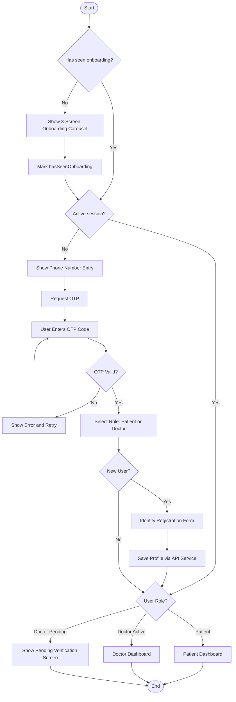

#### Activity Diagram 2: Patient Books a Consultation
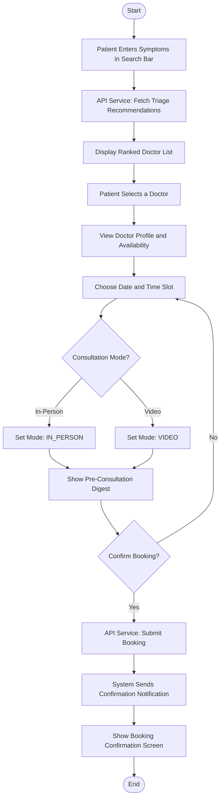

#### Activity Diagram 3: Doctor Issues a Prescription
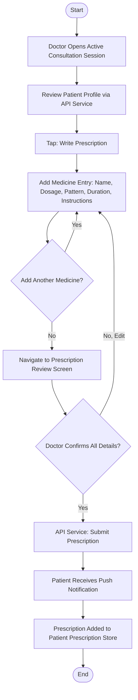

#### Activity Diagram 4: Emergency Protocol Access
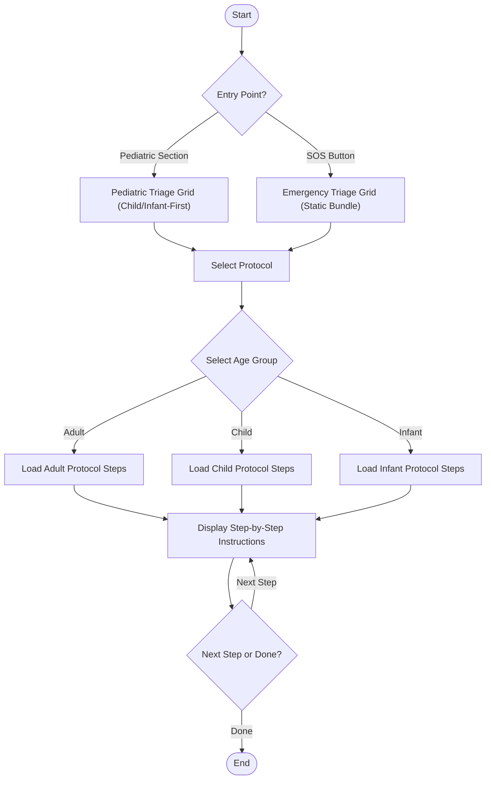

## Chapter 3: System Architecture & Design

### Technology Stack
- **Mobile Application:** React Native (0.86.0), Expo SDK 57, TypeScript 6.0, Expo Router 4.
- **State Management:** Zustand, TanStack Query.
- **Storage:** react-native-mmkv, expo-secure-store.
- **Backend Stack:** Python 3.11+, FastAPI, SQLAlchemy (async), Alembic, Celery + APScheduler.
- **Infrastructure:** PostgreSQL + pgvector, Cloudflare R2, Firebase Authentication, SSL Wireless SMS Gateway, Agora RTC.

### System Flow Chart

The following flow charts illustrate the complete system workflow, split into four logical sections for clarity and presentation readability.

#### Flow Chart 1 — User Entry and Authentication

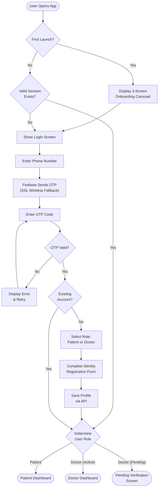

#### Flow Chart 2 — Patient Core Workflows

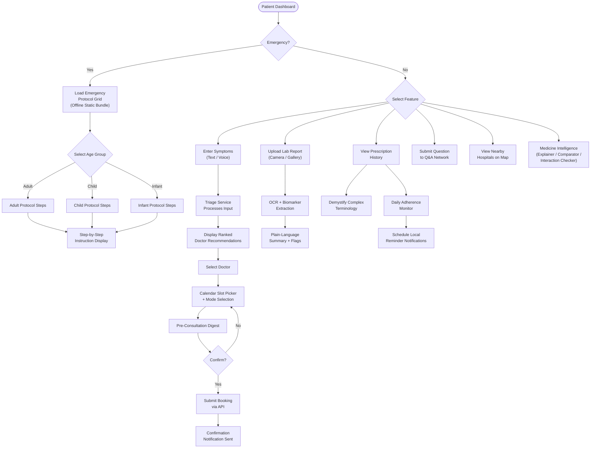

#### Flow Chart 3 — Doctor Core Workflows

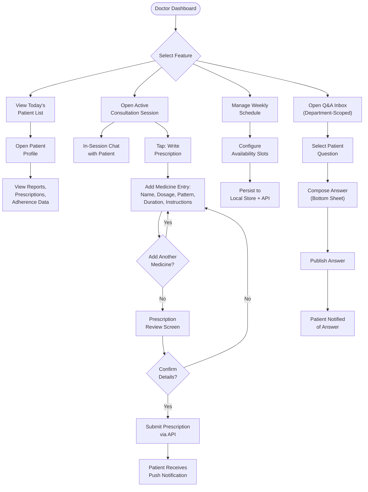

#### Flow Chart 4 — Backend Processing and Cross-Cutting Services

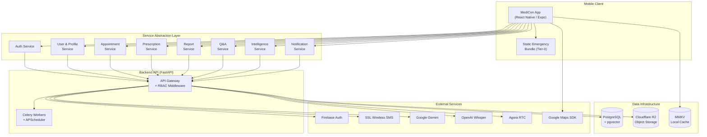

### Class Diagram

```mermaid
classDiagram
    direction TB

    class User {
        +String id
        +String phone
        +UserRole role
        +UserStatus status
        +DateTime createdAt
        +register(phone, role) User
        +verifyOTP(code) Boolean
        +updateStatus(status) void
    }

    class PatientProfile {
        +String id
        +String userId
        +String fullName
        +Date dateOfBirth
        +String bloodGroup
        +Float heightCm
        +Float weightKg
        +String[] allergies
        +String[] chronicConditions
        +update(data) void
    }

    class DoctorProfile {
        +String id
        +String userId
        +String fullName
        +String department
        +String licenseNumber
        +Float consultationFee
        +Boolean isOnline
        +Float rating
        +Int reviewCount
        +CredentialStatus credentialStatus
        +setOnlineStatus(status) void
        +approve() void
    }

    class Dependent {
        +String id
        +String patientId
        +String fullName
        +String relationship
        +Date dateOfBirth
        +String bloodGroup
    }

    class EmergencyContact {
        +String id
        +String patientId
        +String name
        +String phone
        +String relation
    }

    class Appointment {
        +String id
        +String patientId
        +String doctorId
        +DateTime scheduledAt
        +AppointmentStatus status
        +ConsultationMode mode
        +confirm() void
        +cancel() void
    }

    class Consultation {
        +String id
        +String appointmentId
        +DateTime startedAt
        +DateTime endedAt
        +String notes
        +start() void
        +end() void
    }

    class ConsultationMessage {
        +String id
        +String consultationId
        +String senderId
        +String content
        +DateTime timestamp
    }

    class PreConsultationDigest {
        +String id
        +String appointmentId
        +String patientNotes
        +String[] symptoms
    }

    class Prescription {
        +String id
        +String patientId
        +String doctorId
        +DateTime issuedAt
        +String notes
        +PrescriptionSource source
    }

    class PrescriptionMedicine {
        +String id
        +String prescriptionId
        +String name
        +String dosage
        +Int durationDays
        +Int timesPerDay
        +Time[] times
        +String dosagePattern
        +String frequency
        +String instructions
    }

    class AdherenceRecord {
        +String id
        +String prescriptionId
        +String medicineId
        +Date date
        +AdherenceStatus status
    }

    class Report {
        +String id
        +String patientId
        +String title
        +String type
        +Date date
        +String laboratory
        +String summary
    }

    class Biomarker {
        +String id
        +String reportId
        +String name
        +String value
        +String referenceRange
        +Boolean isFlagged
    }

    class VitalReading {
        +String id
        +String patientId
        +String type
        +Float value
        +String unit
        +DateTime recordedAt
    }

    class Medicine {
        +String id
        +String genericName
        +String brandName
        +String manufacturer
        +String category
    }

    class Question {
        +String id
        +String patientId
        +String department
        +String content
        +DateTime createdAt
    }

    class QuestionAnswer {
        +String id
        +String questionId
        +String doctorId
        +String content
        +DateTime answeredAt
    }

    class ScheduleSlot {
        +String id
        +String doctorId
        +Int dayOfWeek
        +Time startTime
        +Time endTime
        +Boolean isAvailable
    }

    class Hospital {
        +String id
        +String name
        +String address
        +Float latitude
        +Float longitude
        +Boolean hasEmergencyRoom
        +String emergencyNumber
    }

    class EmergencyProtocol {
        +String id
        +String title
        +String targetAge
        +String description
    }

    class ProtocolStep {
        +String id
        +String protocolId
        +Int orderIndex
        +String instruction
        +String imageUrl
    }

    class SystemNotification {
        +String id
        +String userId
        +String title
        +String message
        +NotificationType type
        +Boolean isRead
        +DateTime createdAt
    }

    class UserRole {
        <<enumeration>>
        PATIENT
        DOCTOR
    }
    class UserStatus {
        <<enumeration>>
        ACTIVE
        PENDING
    }
    class CredentialStatus {
        <<enumeration>>
        PENDING
        APPROVED
    }
    class AppointmentStatus {
        <<enumeration>>
        PENDING
        CONFIRMED
        COMPLETED
        CANCELLED
    }
    class ConsultationMode {
        <<enumeration>>
        IN_PERSON
        VIDEO
    }
    class AdherenceStatus {
        <<enumeration>>
        TAKEN
        PENDING
        MISSED
    }
    class PrescriptionSource {
        <<enumeration>>
        DOCTOR
        UPLOADED
    }
    class NotificationType {
        <<enumeration>>
        REMINDER
        CONFIRMATION
        QNA_ANSWER
        SYSTEM
    }

    User "1" *-- "0..1" PatientProfile : has
    User "1" *-- "0..1" DoctorProfile : has
    PatientProfile "1" o-- "0..*" Dependent : manages
    PatientProfile "1" o-- "0..*" EmergencyContact : has
    PatientProfile "1" --> "0..*" Appointment : books
    DoctorProfile "1" --> "0..*" Appointment : assigned to
    Appointment "1" *-- "0..1" PreConsultationDigest : includes
    Appointment "1" --> "0..1" Consultation : initiates
    Consultation "1" *-- "0..*" ConsultationMessage : contains
    PatientProfile "1" --> "0..*" Prescription : receives
    DoctorProfile "1" --> "0..*" Prescription : writes
    Prescription "1" *-- "1..*" PrescriptionMedicine : contains
    Prescription "1" --> "0..*" AdherenceRecord : tracked by
    PatientProfile "1" --> "0..*" Report : owns
    Report "1" *-- "0..*" Biomarker : contains
    PatientProfile "1" --> "0..*" VitalReading : logs
    PatientProfile "1" --> "0..*" Question : asks
    Question "1" *-- "0..*" QuestionAnswer : receives
    DoctorProfile "1" --> "0..*" QuestionAnswer : provides
    DoctorProfile "1" *-- "0..*" ScheduleSlot : configures
    EmergencyProtocol "1" *-- "1..*" ProtocolStep : contains
    User "1" --> "0..*" SystemNotification : receives
    DoctorProfile "0..*" --> "0..*" Hospital : affiliated with
```

### Database ER Diagram

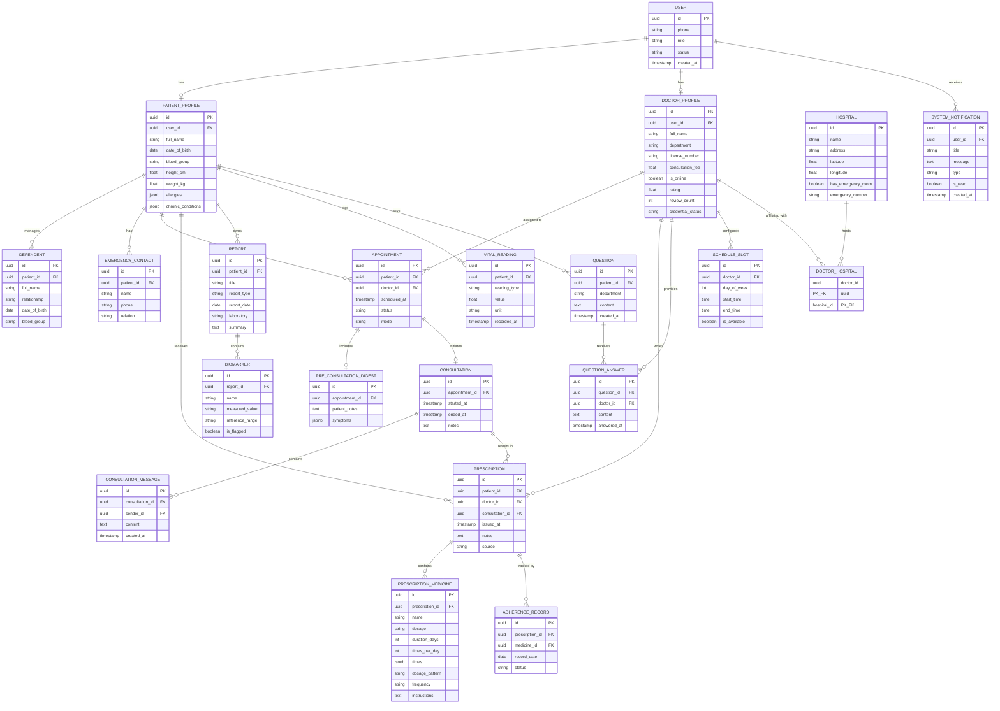

## Chapter 4: Development Methodology

The project adheres to Agile development methodologies, prioritizing iterative design, cross-functional testing, and modular architecture. The application is divided into feature-based epics (e.g., Auth & Onboarding, Patient Dashboard, Doctor Portal) allowing parallel development of the mobile client and backend services. Testing includes unit testing for business logic, integration testing across the service abstraction layers, and automated end-to-end testing for critical user journeys. Continuous integration pipelines validate code formatting and enforce strict TypeScript rules. 

## Chapter 5: Feature Implementation

- **Onboarding and Registration:** A three-screen visual carousel leading to an OTP-based authentication flow. Captures identity and assigns Patient or Doctor roles.
- **Role-Aware Navigation:** Expo Router configuration enforcing distinct tab structures for Patients and Doctors, preventing unauthorized access.
- **Patient Dashboard:** A personalized hub featuring an SOS button, appointments, and medication reminders.
- **Doctor Portal and Management:** Dashboard summarizing daily queues, patient records, and weekly schedule configuration.
- **Digital Prescription Engine:** A multi-medicine form for constructing precise dosage regimens and issuing verified prescriptions.
- **Emergency Response Module:** A 100% offline-capable library of life-saving protocols with age-specific variations.
- **Q&A Network:** A public, anonymized forum for medical queries routed to specific departments.
- **Symptom Triage and Medicine Intelligence:** Natural language processing of symptoms and comprehensive tools for checking medicine interactions.
- **Lab Report Interpreter:** Pipeline for extracting biomarker data, flagging anomalies, and generating non-technical summaries.
- **Prescription Demystifier and Adherence:** Breakdown of instructions coupled with an append-only daily logging system.
- **Hospitals Map & Notifications:** Interactive map and a unified inbox for alerts and reminders.

## Chapter 6: Medical Safety & Compliance

The platform enforces a rigid safety boundary around its intelligent features:
- **No Diagnostics:** The system is constrained to refuse definitive diagnosis.
- **Disclaimer Injection:** All generated text is appended with a prominent, server-enforced medical disclaimer.
- **Emergency Escalation:** Detection of severe symptoms automatically triggers the emergency module CTA, halting further analysis.
- **Compliance:** Communication is encrypted over HTTPS/TLS 1.2+. The architecture supports auditing and logging necessary for compliance with Bangladesh telemedicine standards, and no Protected Health Information (PHI) is stored in standard application logs.

## Chapter 7: Limitations

- **Platform Exclusivity:** The application is currently developed exclusively for Android; iOS devices are not supported.
- **Administrative Dashboard:** An administrative web dashboard for system super-users is out of scope (doctor credentialing is handled via internal API).
- **Payment Gateways:** In-app payment processing for consultations is deferred and handled externally.
- **Hardware Integration:** Direct integration with Bluetooth IoT medical devices is currently not supported.
- **Internet Dependency for Advanced Features:** While emergency protocols are entirely offline, features such as real-time consultations and map rendering require active connectivity.

## Chapter 8: Future Work

Future developments are planned to expand and enhance the MediCon platform:
- **iOS Deployment:** Expand platform availability to Apple devices.
- **IoT Integration:** Support for smart health devices for automated vital logging.
- **Advanced Telemetry:** Enhanced analytics for epidemiological tracking.
- **Payment Gateways:** Native integration for local mobile financial services (e.g., bKash, Nagad).

## Chapter 9: Conclusion

MediCon successfully addresses the pressing need for accessible, reliable, and culturally tailored digital healthcare solutions in Bangladesh. By uniting advanced technologies, rigorous security protocols, and offline capabilities into a seamless bilingual platform, the system empowers patients to take charge of their health and provides medical professionals with efficient workflow tools. The clear segregation of roles, stringent medical safety guardrails, and modular design ensure a scalable and maintainable application, representing a significant advancement in resource-constrained telemedicine environments.

## References

1. Agarwal, S., Perry, H. B., Long, L. A., & Labrique, A. B. (2015). Evidence on feasibility and effective use of mHealth strategies by frontline health workers in developing countries: systematic review. Tropical Medicine & International Health, 20(8), 1003-1014.
2. Khatun, F., Heywood, A. E., Ray, P. K., Hanifi, S. M. A., Bhuiya, A., & Liaw, S. T. (2014). Determinants of readiness to adopt mHealth in a rural community of Bangladesh. International Journal of Medical Informatics, 84(10), 847-856.
3. Semigran, H. L., Linder, J. A., Gidengil, C., & Mehrotra, A. (2015). Evaluation of symptom checkers for self diagnosis and triage: audit study. BMJ, 351, h3480.
4. World Health Organization. (2003). Adherence to long-term therapies: evidence for action.
5. Nieuwlaat, R., Wilczynski, N., Navarro, T., Hobson, N., Jeffery, R., Keepanasseril, A., ... & Haynes, R. B. (2014). Interventions for enhancing medication adherence. Cochrane Database of Systematic Reviews, (11).
6. Deering, S., Johnston, A. M., & Colacchio, K. (2019). Multidisciplinary teamwork and communication training. Seminars in Perinatology, 43(8), 151167.
7. React Native Documentation, Expo SDK 57 API Reference, and FastAPI Documentation.
8. Bangladesh Ministry of Health and Family Welfare Guidelines.
